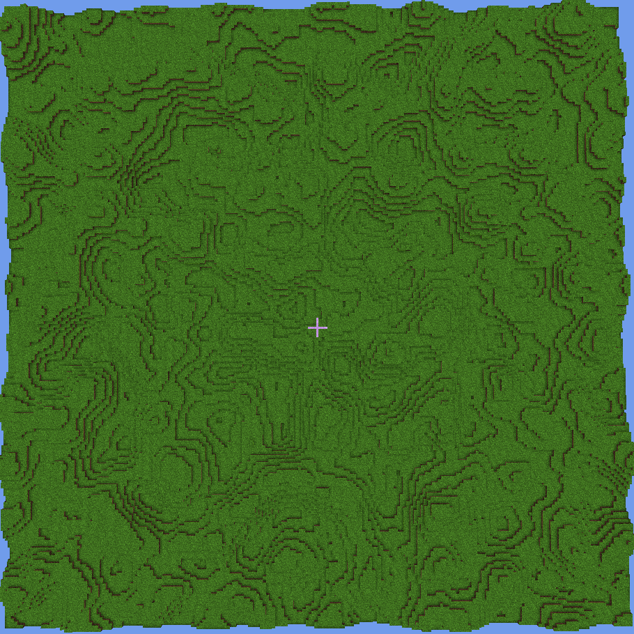
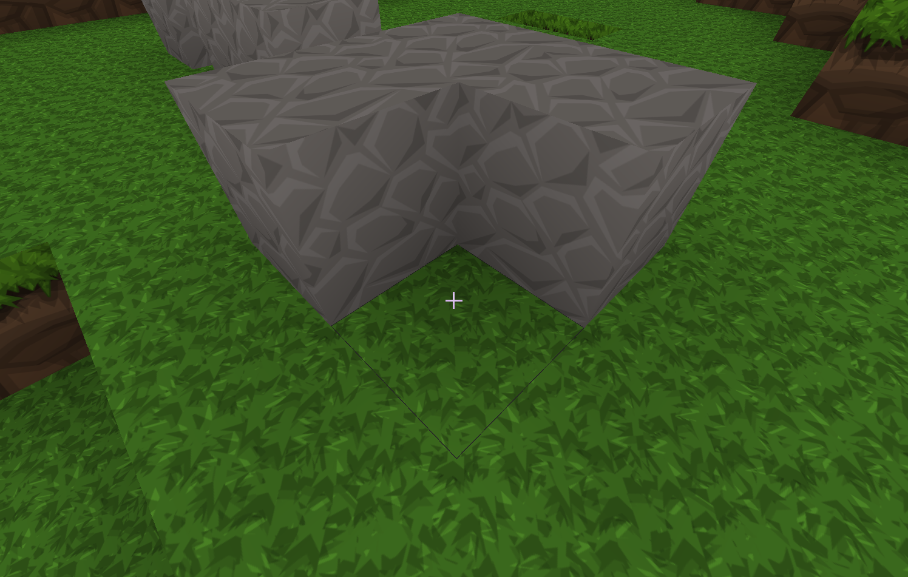

# OpenGL Demo

Welcome to the OpenGL Demo project! This project is a learning exercise inspired by the tutorials on [Learn OpenGL](https://learnopengl.com/). As I progress through the tutorials, I will be updating and expanding this repository.

## Preview
### Below are two images of 41x41 chunks, each containing 16 x 16 x 128 blocks.
#### Aerial view.

#### Close up. 

## Most recent demo:
[Most Recent Updates On Youtube](https://www.youtube.com/watch?v=nKIjua3wax8)
## Getting Started

### Libraries in Use

- **OpenGL**: Version 4.6
- **GLM**: Version 1.0.1
- **GLFW**: Version 3.4
- **GLAD**: Generated version 0.1.36 from [GLAD generator](https://glad.dav1d.de/)
- **nlohmann_json**: Version 3.11.3 (just the json.h)
- **stb_image**: Version 2.29

### Project Structure

The project directory structure is organized as follows:

```
OpenGLDemo/
├── includes/
│   └── glad/
│       ├── include/
│       └── src/
│   └── stb/
│       ├── include/
├── src/
|   ├── assets/
│   |   ├── json/     ... Json files for configuring textures.
│   |   ├── shader/   ... All GLSL Shader code.
|   |   └── textures/ ... Images for textures
|   ├── craft/
|   |   └── ... Game related files.
|   ├── helpers/
│   ├── setup/
|   |   └── ... OpenGL and GLFW configuration and set up.
│   └── main.cpp
├── CMakeLists.txt
├── README.md (Good Job!)
└── ...
```

### Running the Project

#### Through Cloning / Downloading
1. Go to the top and click the "Code" drop down.
2. **Download** the zip file
3. Extract zip

## Running the Project

1. **Clone the Repository**
   
   With Progress Images and Videos (Download mp4's and png's related to my progress)
   ```bash
   git clone https://github.com/Nickhunt2243/opengl-demo.git
   cd opengl-demo
   ```
   Without Progress Images and Videos (Less data quicker download times)
   ```
   git clone --no-checkout https://github.com/Nickhunt2243/opengl-demo.git
   cd opengl-demo
   git sparse-checkout init --cone
   git sparse-checkout set . includes src
   git checkout (may result in: Your branch is up to date with 'origin/master'.)
   ```


2. **Build and Hopefully Run The Program!**

   Use CMake to generate the build files for your preferred build system:

   ```bash
   # Step 1: Configure the project
   cmake -S . -B build

   # Step 2: Build the project
   cmake --build build --target OpenGLDemo --config Debug
   
   cd Debug
   OpenGlDemo.exe
   ```
   
   Or simply run

   ```
   cd buildhelpers & build.bat (Windows)
   .\buildhelpers\build.sh  (MacOS / Linux)
   ```

## Controls

You can use:
- w &#8594; Walk Forward
- s &#8594; Walk Backwards
- a &#8594; Walk Left
- d &#8594; Walk Right
- f &#8594; Enable/Disable Flying
- space &#8594; jump or fly up.
- left shift &#8594; fly down (when enabled)
- Left click &#8594; delete block
- Right click &#8594; place block
- Move Mouse &#8594; Look Around
## Project Structure

The project is organized into the following main components:

- **assets**: All assets needed for the game to run (shaders/textures/metadata).
- **craft**: This folder will contain all code needed for generating the minecraft-like world.
- **helpers**: Helper functions to be used globally.
- **setup**: Code for setting up and running the application (may change name in future).

## Contact

For any questions or inquiries, please contact nickrhunt@yahoo.com or reach out to me on [LinkedIn](https://linkedin.com/in/nicholas-r-hunt)

Thank you for checking out this project! Happy coding!
