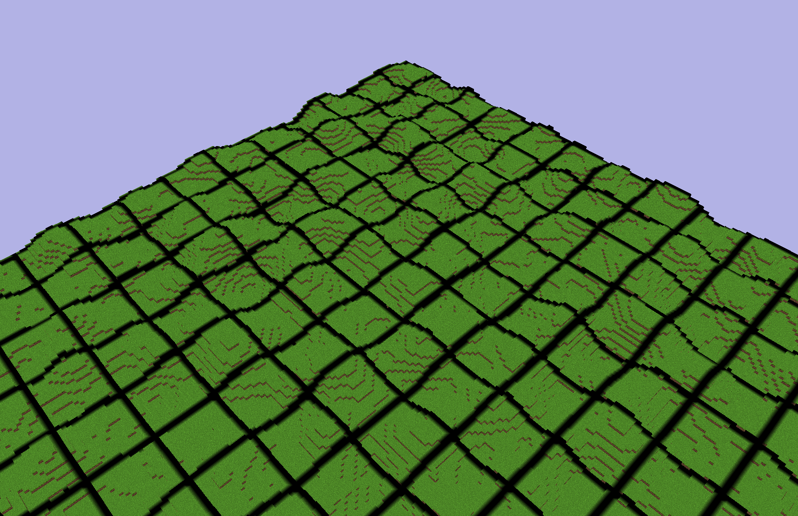
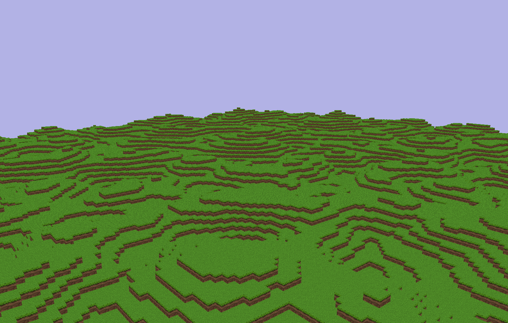

# OpenGL Demo

Welcome to the OpenGL Demo project! This project is a learning exercise inspired by the tutorials on [Learn OpenGL](https://learnopengl.com/). As I progress through the tutorials, I will be updating and expanding this repository.

## Preview
### Below are two images of 21x21 chunks, each containing 16 x 16 x 128 blocks.
#### Aerial view with simple borders for better perspective.


#### Ground view.


## Getting Started

### Prerequisites

Before you can build and run this project, you need to have the following libraries installed:

- **OpenGL**: Version 3.3
- **GLM**: Version 1.0.1
- **GLFW**: Version 3.4
- **GLAD**: Generated version 0.1.36 from [GLAD generator](https://glad.dav1d.de/)
- **nlohmann_json**: Version 3.11.3 (just the json.h)
- **stb_image**: Version 2.29 

### Project Structure

The project directory structure is organized as follows:

```
OpenGLDemo/
├── includes/
│   ├── GLFW/
│   │   ├── includes/
│   │   │   └── <GLFW include files>
│   │   └── lib-vc2022/
│   │       └── <GLFW library files>
│   ├── GLM/
│   └── GLAD/
│       ├── include/
│       └── src/
├── src/
|   ├── assets/
|   ├── craft/
|   |   └── ... Game related files.
|   ├── helpers/
│   ├── setup/
|   |   └── ... OpenGL and GLFW configuration and set up.
│   ├── shaders/
│   └── main.cpp
├── CMakeLists.txt
├── README.md
└── ...
```

### Running the Project

#### Through Release (Still requires some dependencies from VS.)
1. Go to current release.
2. Download most recent zip.
3. Unzip the file.
4. Go into bin/ and run the OpenGLDemo.exe file.

#### Through Cloning (better off cloning)
1. Clone the Reposity (see below for cloning steps).
2. Go into bin/ and run the OpenGLDemo.exe file.

### Building the Project

1. **Clone the Repository**

   ```bash
   git clone https://github.com/Nickhunt2243/opengl-demo.git
   cd opengl-demo
   ```

2. **Install Dependencies**

   Ensure that you have the required libraries installed on your system. You may need to set the paths for GLM, GLFW, and GLAD in your development environment.

3. **Generate Build Files**

   Use CMake to generate the build files for your preferred build system. For example, to generate Visual Studio project files:

   ```bash
   mkdir build
   cd build
   cmake .. -G "Visual Studio 17 2022" [or whichever Visual Studio version you have.]
   ```

4. **Build the Project**

   Open the generated project in Visual Studio (or your preferred IDE) and build the project.

   Alternatively, you can build from the command line:

   ```bash
   cmake --build .
   cd ../Debug
   OpenGLDemo.exe
   ```

### Running the Project

After successfully building the project, you can run the executable. The application should open a window and render the scene with a massive cube in front of you.

You can use:
- w &#8594; Walk Forward
- s &#8594; Walk Backwards
- a &#8594; Walk Left
- d &#8594; Walk Right
- space &#8594; Go up
- left shift &#8594; Go down

Additionally, you can use the mouse to look around.

### Project Structure

The project is organized into the following main components:

- **assets**: All assets needed for the game to run (shaders/textures/metadata).
- **craft**: This folder will contain all code needed for generating the minecraft-like world.
- **helpers**: Helper functions to be used globally.
- **setup**: Code for setting up and running the application (may change name in future).

### Contact

For any questions or inquiries, please contact nickrhunt@yahoo.com.

Thank you for checking out this project! Happy coding!
